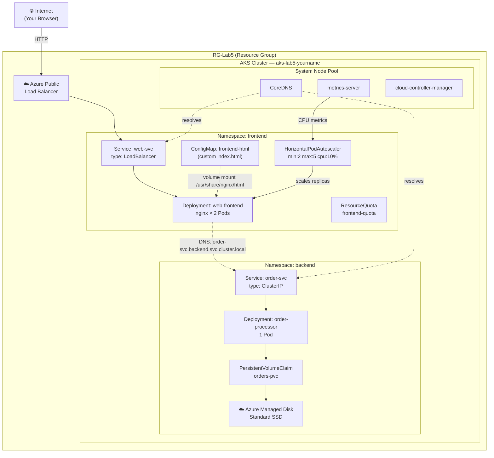

# AKS Core Concepts — 8 Slides × 2 Minutes

---

## Slide 1 — What is AKS?

- Kubernetes is a container orchestrator: scheduling, self-healing, scaling, networking, storage
- **AKS** is Azure's managed Kubernetes — Azure owns the control plane (API server, etcd, scheduler) at no extra cost; you pay only for the agent node VMs
- Why AKS? No control-plane patching, integrated Azure AD, ACR, Monitor, Key Vault
- 📖 [What is Azure Kubernetes Service (AKS)?](https://learn.microsoft.com/azure/aks/what-is-aks)

---

## Slide 2 — Cluster Architecture

- **Control plane** (Azure-managed): API Server → Scheduler → Controller Manager → etcd
- **Node pools** (you manage):
  - *System pool* — runs AKS system Pods (CoreDNS, Cilium, CSI drivers)
  - *User pool* — runs your application workloads
- Nodes are VMs running `kubelet` + `containerd`; you interact via `kubectl` → API Server
- 📖 [Core AKS concepts](https://learn.microsoft.com/azure/aks/core-aks-concepts)

---

## Slide 3 — Pods, Deployments & Namespaces

- **Pod**: smallest unit — one or more containers sharing network + storage; ephemeral
- **Deployment**: declares desired state (image, replicas, limits); controller reconciles actual → desired; provides self-healing + rollback
- **Namespace**: logical partition of the cluster — combine with RBAC + ResourceQuota for team isolation
- 📖 [Core AKS concepts](https://learn.microsoft.com/azure/aks/core-aks-concepts)

---

## Slide 4 — Services & Networking

- Pod IPs are ephemeral — a **Service** provides a stable ClusterIP + DNS name (`svc.namespace.svc.cluster.local`)
- CoreDNS resolves service names automatically inside the cluster

| Type | Exposure | Azure resource |
|---|---|---|
| ClusterIP | Internal only | None |
| NodePort | Node IP + port | None |
| LoadBalancer | Public internet | Azure Public LB |
| ExternalName | DNS alias | None |

- 📖 [Networking concepts for AKS](https://learn.microsoft.com/azure/aks/concepts-network)

---

## Slide 5 — ConfigMaps & Secrets

- **ConfigMap**: non-sensitive config (files, env vars) injected into Pods without rebuilding the image
- **Secret**: sensitive data (passwords, tokens) — RBAC-gated; integrate with Azure Key Vault via CSI driver for production
- Both can be mounted as files or exposed as environment variables
- Decouples configuration from container images → change config without a redeploy
- 📖 [Security concepts for AKS](https://learn.microsoft.com/azure/aks/concepts-security)

---

## Slide 6 — Persistent Storage

- Containers are stateless by default — data lost on restart
- **PVC (PersistentVolumeClaim)**: a request for storage; StorageClass provisions the Azure resource dynamically

| StorageClass | Access Mode | Backed by |
|---|---|---|
| `managed-csi` | ReadWriteOnce | Azure Managed Disk |
| `azurefile-csi` | ReadWriteMany | Azure Files (SMB) |

- PVC survives Pod restarts, deletions, and rescheduling to another node
- 📖 [Storage options for AKS](https://learn.microsoft.com/azure/aks/concepts-storage)

---

## Slide 7 — Resource Management & Autoscaling

- **Requests**: guaranteed minimum — scheduler places Pod only where satisfied
- **Limits**: maximum allowed — CPU throttle; memory → OOM-kill if exceeded
- **ResourceQuota**: caps total CPU + memory across all Pods in a namespace
- **HPA (HorizontalPodAutoscaler)**: auto-adjusts replica count based on CPU/memory metrics from `metrics-server`; scale-in has a 5 min cool-down to prevent thrashing
- 📖 [Scaling options for AKS](https://learn.microsoft.com/azure/aks/concepts-scale)

---

## Slide 8 — Rolling Updates & Key Takeaways

- **Rolling update**: replaces one Pod at a time; new Pod must pass readiness probe before old one terminates → zero downtime
- `kubectl rollout undo` reverts to any prior revision instantly (backed by ReplicaSet history)

| Concept | Kubernetes mechanism |
|---|---|
| Self-healing | Deployment controller |
| Stable networking | Service + CoreDNS |
| Zero-downtime updates | Rolling update strategy |
| Durable storage | PVC → Azure Managed Disk |
| Resource fairness | Requests/Limits + ResourceQuota |
| Auto scale-out | HPA + metrics-server |

- 📖 [App & cluster reliability best practices](https://learn.microsoft.com/azure/aks/best-practices-app-cluster-reliability)

---

## Slide 9 — Lab Introduction: What You Will Build

**Scenario:** Your organisation is modernising a retail order management platform. Two microservices have already been containerised — your job is to deploy, expose, update, and operate them on AKS.

**Lab Architecture:**

**7 Tasks — 90 minutes:**

| Task | What you do | Concept practised |
|---|---|---|
| 1 | Provision AKS cluster + connect with `kubectl` | AKS provisioning |
| 2 | Explore nodes, namespaces, system Pods | Cluster structure |
| 3 | Deploy `web-frontend` with a ConfigMap | Deployment · self-healing |
| 4 | Expose it via a LoadBalancer Service | Service · Azure LB |
| 5 | Rolling update nginx 1.25 → 1.27, then roll back | Zero-downtime updates |
| 6 | Attach PVC to `order-processor`, simulate crash | Persistent storage |
| 7 | Apply ResourceQuota + HPA + namespace isolation | Operational patterns |

- 📖 [AKS Lab Day 5](Lab-Day5-AKS.md)

---

*Total: 9 slides × 2 minutes = 18 minutes*
